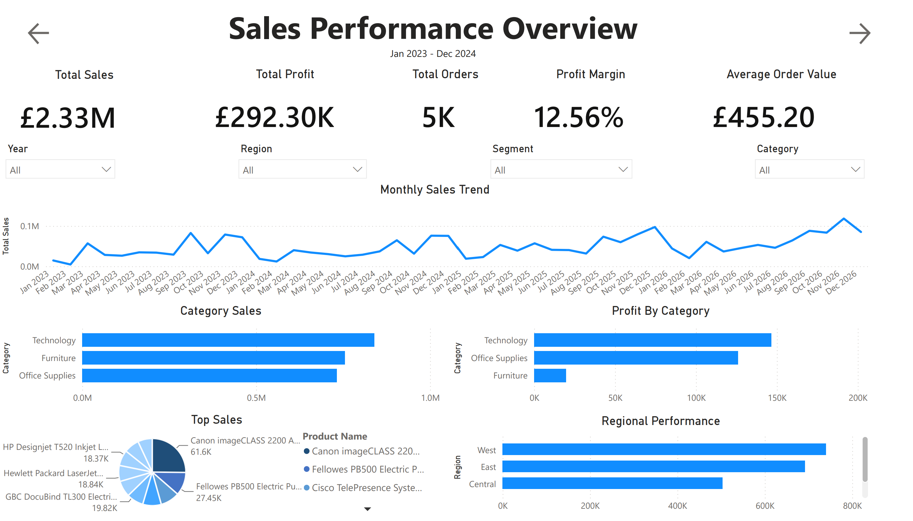
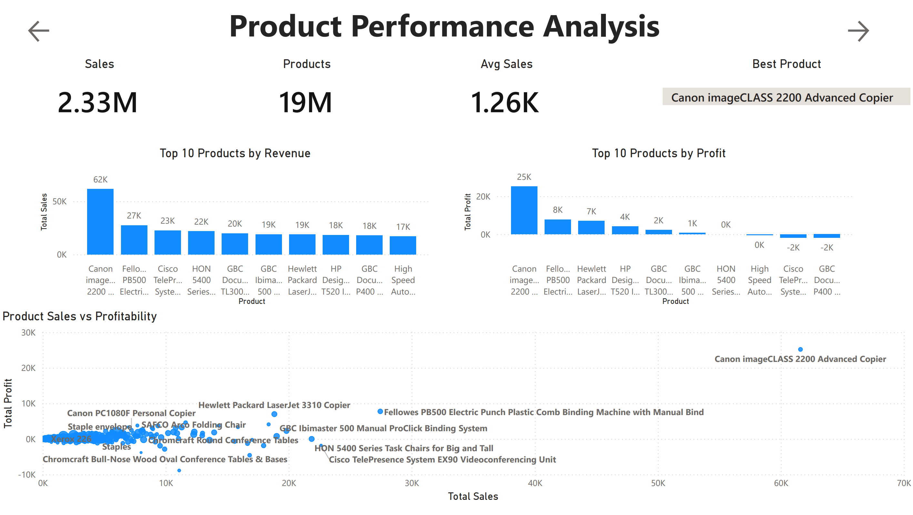
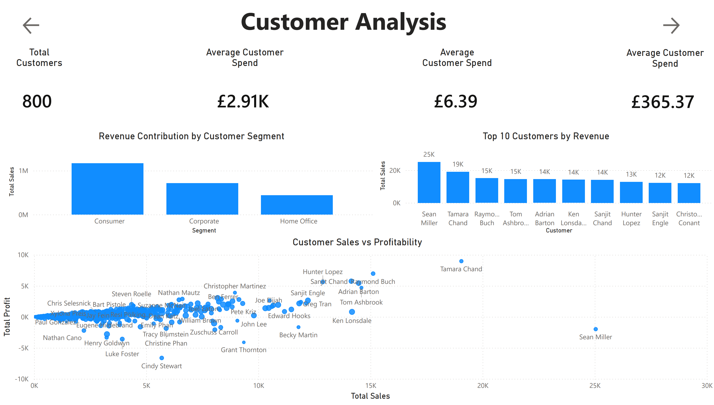
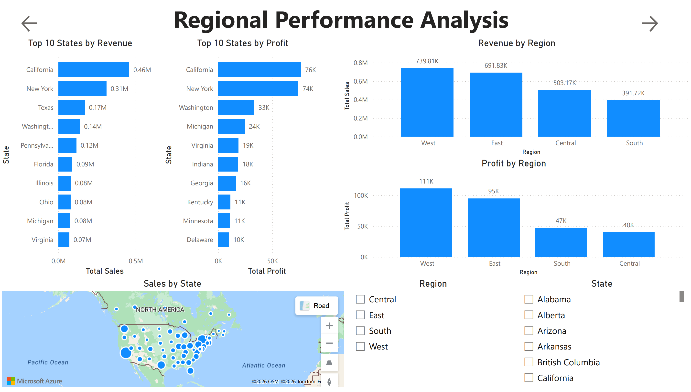

# Sales Analytics Dashboard

## Project Overview

This project is an end-to-end sales analytics solution that transforms raw transactional data into actionable business insights.

The project follows a complete analytics workflow:

**Data Cleaning → Exploratory Analysis → Business Intelligence Reporting**

Using **Python**, **SQL**, and **Power BI**, I cleaned and prepared the dataset, performed exploratory analysis to identify trends and performance drivers, and developed an interactive dashboard analysing sales performance, product profitability, customer behaviour, and regional performance.

The objective was to demonstrate how data can be transformed into meaningful insights that support business decision-making.

---

# Executive Summary KPIs

* **Total Revenue:** £2.33M
* **Total Profit:** £292.30K
* **Profit Margin:** 12.56%
* **Total Orders:** 5K
* **Average Order Value (AOV):** £455.20

---

# Business Objectives

The aim of this project was to answer key business questions:

* How is overall sales performance changing over time?
* Which products generate the most revenue and profit?
* Which customers contribute the most value?
* Which regions perform best?
* Are high-sales products and customers also the most profitable?

---

# Tools & Technologies

| Tool            | Purpose                                             |
| --------------- | --------------------------------------------------- |
| Python (Pandas) | Data cleaning, transformation, and preparation      |
| SQL             | Data exploration and business analysis              |
| Power BI        | Interactive dashboard development and visualisation |
| DAX             | Creating calculated measures and KPIs               |
| GitHub          | Project documentation and version control           |

---

# Project Workflow

## 1. Data Cleaning & Preparation (Python)

The raw dataset was cleaned and prepared using Python.

Key steps included:

* Inspecting data quality and structure
* Handling missing values
* Removing duplicate records
* Correcting data types
* Standardising date fields
* Creating additional fields required for analysis
* Preparing a clean dataset for SQL analysis and Power BI reporting

The cleaned dataset was then exported for further analysis.

---

## 2. Data Analysis (SQL)

SQL was used to explore the dataset and answer business-focused questions.

Analysis included:

### Sales Performance

* Total sales and profit trends
* Monthly sales performance
* Revenue breakdown by category and segment

### Product Analysis

* Top-performing products by sales
* Most profitable products
* Product-level sales and profitability comparisons

### Customer Analysis

* Highest-value customers
* Customer segment performance
* Customer purchasing behaviour

### Regional Analysis

* Sales performance by region
* Profitability across geographic areas
* Identification of strong and weak performing locations

---

# 3. Power BI Dashboard

An interactive Power BI report was created to present key insights through multiple analytical pages.

## Sales Performance Overview

Provides an executive-level summary of overall business performance.

Includes:

* Executive KPIs including total revenue, profit, profit margin, orders, and average order value
* Monthly sales trends to identify changes in performance over time
* Category-level analysis comparing revenue and profitability across Technology, Furniture, and Office Supplies
* Regional performance analysis highlighting key revenue contributors

---

## Product Performance Analysis

Analyses product-level performance to understand which products drive revenue and profitability.

Includes:

* Identification of top-performing products by sales and profit
* Comparison of revenue generation against profitability
* Scatter plot analysis highlighting products with strong sales performance but weaker profit contribution
* Identification of potential opportunities for improving product profitability

---

## Customer Analysis

Explores customer behaviour, purchasing patterns, and value contribution.

Includes:

* Customer-level performance metrics including average spend and order behaviour
* Revenue comparison across Consumer, Corporate, and Home Office segments
* Identification of highest-value customers by revenue
* Analysis of customer profitability to highlight differences between sales volume and business value

---

## Regional Performance Analysis

Examines geographic differences in sales performance and profitability.

Includes:

* Revenue and profit comparisons across regions
* State-level analysis identifying key contributors to overall performance
* Geographic visualisations showing sales distribution
* Identification of regions with opportunities for improving profitability

---

# Dashboard Preview

---

# Key Insights

## 1. Product Performance & Profitability

* The **Canon imageCLASS 2200 Advanced Copier** was the highest-performing product, generating approximately **£62K in sales** and **£25K in profit**.
* High revenue did not always translate into profitability. Products such as the **Cisco TelePresence System EX90** generated significant sales (**£23K**) but resulted in a loss (**-£2K profit**), highlighting the importance of analysing profitability alongside revenue.
* The **Technology** category was the strongest overall performer, generating approximately **£1.0M in sales** and **£145K in profit**, while **Furniture** generated similar revenue levels but significantly lower profitability.

## 2. Regional Performance

* The **West region** was the strongest-performing region, generating approximately **£739.81K in sales** and **£111K in profit**.
* **California** and **New York** were the largest state-level contributors, generating approximately **£0.46M** and **£0.31M** in sales respectively.
* Some high-revenue locations showed weaker profitability, highlighting opportunities to investigate pricing strategies, discounting, and cost structures.

## 3. Customer & Segment Insights

* The **Consumer** segment generated the highest sales volume, making it the largest contributor to overall revenue.
* Customer revenue and profitability were not always aligned. Some high-revenue customers generated relatively low profit, demonstrating the importance of evaluating customer value beyond sales volume.
* Customer profitability analysis highlighted opportunities to identify and retain high-value accounts.

---

# Strategic Recommendations

1. **Improve Product Profitability**
   - Review pricing, discounting, and cost structures for products generating strong sales but limited or negative profitability.
   - Investigate products such as the **Cisco TelePresence System EX90** and **GBC DocuBind P400** to identify opportunities to improve margins.

2. **Optimise Category Performance**
   - Analyse the drivers behind lower Furniture profitability, including discount levels, product costs, and operational expenses.
   - Identify opportunities to improve margins while maintaining sales performance.

3. **Investigate Regional Profitability Differences**
   - Explore why some high-revenue regions generate comparatively lower profit.
   - Analyse regional discounting patterns, product mix, and operational factors to identify improvement opportunities.

---

# Project Structure
Sales Analytics/
│
├── Dashboard/
│   ├── Sales_Analytics_Dashboard.pbix
│   └── Sales_Analytics_Dashboard.pdf
│
├── Data/
│   ├── raw_data.csv
│   └── cleaned_data.csv
│
├── Docs/
│
├── Images/
│   ├── sales_overview.png
│   ├── product_performance.png
│   ├── customer_analysis.png
│   └── regional_analysis.png
│
├── Notebooks/
│   └── Data_Cleaning_and_Preparation.ipynb
│
├── SQL/
│   └── sales_analysis.sql
│
└── README.md

---

# Skills Demonstrated

Through this project, I demonstrated:

* Data cleaning and preparation
* Exploratory data analysis
* SQL querying and analysis
* Data modelling
* DAX measure creation
* Dashboard design
* Data storytelling
* Business-focused insight generation

---

# Future Improvements

Potential improvements to extend this project:

* Add automated data refresh pipelines
* Introduce forecasting models for future sales prediction
* Add customer segmentation using machine learning techniques
* Build automated reporting workflows

---

# Author

**Ben McDonald**

Aspiring Data Analyst specialising in **Python, SQL, Power BI, and data visualisation**.

This project demonstrates my ability to clean, analyse, and communicate data-driven insights through an end-to-end analytics workflow.